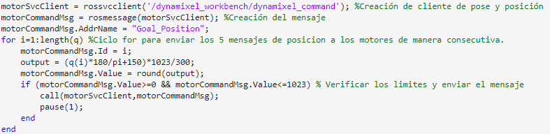

# Laboratorio 4 - Cinemática Directa - Phantom X - ROS

### Por: Sebastian Campiño Figueroa, Julián Felipe Luna Castro y Diego Fernando Mejía Hernández

Este repositorio contiene las memorias y programas desarrollados durante la cuarta practica de laboratorio de la materia Robótica. Esta práctica tiene como objetivo afianzar los conocimientos de cinemática directa mediante el uso de los robots Phantom X Pincher, definiendo los parámetros de Denavit Hartenberg, creando una simulación en Matlab, y comunicando el robot real mediante el uso de ROS, enviando mensajes de cambio de posición para cada una de las articulaciones de forma secuencial.

## Requerimientos
* Ubuntu 20.04 LTS o version compatible
* ROS Noetic
* Espacio de trabajo para catkin correctamente configurado.
* Paquetes de Dynamixel Workbench.  Tomado de: https://github.com/fegonzalez7/rob_unal_clase3
* Paquete del robot Phantom X. Tomado de: https://github.com/felipeg17/px_robot.
* MATLAB 2015b o superior.
* Robotics toolbox de mathworks.
* Toolbox de robótica de Peter Corke.
* Actitud y ganas de aprender.

## 1. Parametros DH y uso del toolBox
Primero medimos las distacias entre cada una de las articulaciones para luego sacar los parametros DH del robot.

Luego creamos su par virtual con el toolbox.

Primero hicimos un diagrama del robot para poder sacar sus parámetros DH y poder hacer su par virtual con el toolbox.
Con el robot creado lo ponemos en la posición de Home para ver su MTH. Cabe aclarar que nosotros escogimos nuestro Home igual al del robot con todos sus motores en 0.

Luego pusimos le robot en diferentes posiciones las cuales son:

Y estos son los resultados:

## 2. Conecciones con MatLab
Primero tenemos que crear un script que sea capas de publicar cada tópico del controlador de junta.
Este script lo que hace es crear el cliente de pose y posición para luego poner el vector objetivo de los motores, cambiar al ID del controlador que se va a utilizar y asignarlo al motor, convertir los grados a 10 bits y por último verificar los límites y enviar el mensaje.

En esta parte básicamente se revisa si el tópico esta activo luego se crea el publicador, se inicializa la recepción del mensaje del suscriptor y luego se imprime el valor de cada junta con su valor en radianes.

## 3. ROS - Python:
<iframe src="https://drive.google.com/file/d/1_-KfOsTiQ6pyHVKFeQCBFIZZih_lxKfY/preview" width="640" height="480" allow="autoplay"></iframe>

Creamos un script en Python que permite seleccionar cada una de las articulaciones del robot, desde cadera hasta muñeca, subiendo o bajando con las teclas W y S, y publicando mensajes de cambio de posición objetivo para cada una de las articulaciones de forma independiente con las teclas A para la posición de Home y D para la posición deseada.

Para iniciar el script, *roscore* debe estar corriendo en una terminal y el archivo *px_controllers.launch* del paquete *px_robot* debe estar corriendo en otra, y luego inicializar el script con Python en una tercera consola.

Este script es el llamado *script.py* ubicado en este mismo repositorio y los resultados de su funcionamiento pueden observarse en el video adjunto.

## 4. Union de todo
Para la parte final utlizamos un ciclo para enviar secuencialmente el mensaje a cada motor. En este momento tambien debe estar corriendo *roscore* y *px_controllers.launch*:

## Conclusiones
* ROS funciona de manera independiente a Matlab o Python, los scripts desarrollados en estos programas solo nos permiten comunicarnos con los diferentes nodos que se encuentren en ejecución.
* Por medio de los paquetes provistos por Dynamixel es posible controlar el Robot PhantomX Pincher de manera sencilla, adicionalmente con el repositorio PXRobot es posible que la comunicación entre los servomotores se de uno a uno de manera serial, lo cuál facilitó la modificación de las poses del robot en Matlab y permite llevar el robot a cualquier posicion deseada dentro de los limite articulares.
## Video:
En el siguiente Drive están los dos videos correspondientes al laboratorio. (No se uso github para eso debido al peso de los mismos):
https://drive.google.com/drive/folders/13NdtriyYnkKi-7e28DYfCpPBhN1BJRzy?usp=sharing
